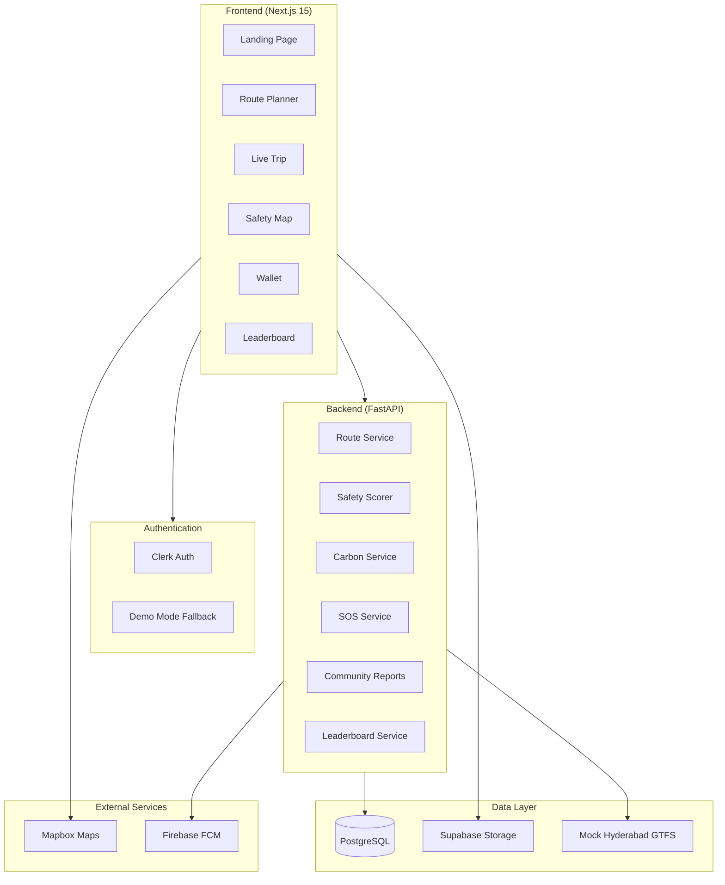
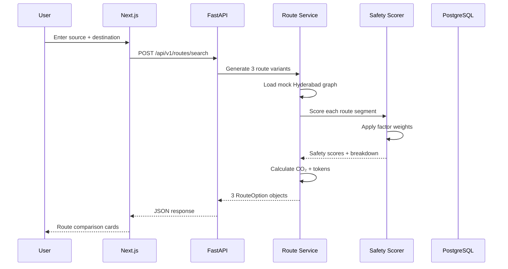
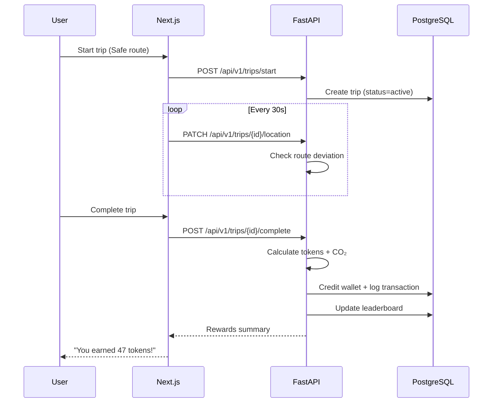

# SafarAI — System Architecture

## High-Level Architecture



## Component Architecture

### Frontend Layers

```
app/                    # Next.js App Router pages
components/
  ui/                   # Shadcn primitives
  maps/                 # Mapbox/Leaflet wrappers
  routes/               # Route cards, comparison
  safety/               # SOS, reports, scores
  wallet/               # Token wallet UI
  layout/               # Nav, shell, mobile bar
lib/
  api/                  # API client (fetch wrappers)
  hooks/                # useTrip, useWallet, useSafety
  stores/               # Zustand stores
  utils/                # Formatters, CO₂ calc
  types/                # TypeScript interfaces
```

### Backend Layers

```
app/
  api/v1/               # REST route handlers
  core/                 # Config, security, deps
  models/               # SQLAlchemy ORM models
  schemas/              # Pydantic request/response
  services/
    routing/            # Journey planner + mock GTFS
    safety/             # Safety scoring engine
    carbon/             # Token + CO₂ calculations
    community/          # Reports + votes
    sos/                # Emergency alerts
  data/
    hyderabad/          # Mock stops, routes, roads
```

## Data Flow: Trip Planning



## Data Flow: Active Trip + Rewards



## Safety Scoring Engine

```
Input: RouteSegment[]
  - road_type, time_of_day, walking_meters
  - nearby_reports[], crowd_level, lighting_level

Process:
  base_score = 70
  for each factor in SAFETY_FACTORS:
    base_score += factor.weight * factor.value

  clamp(base_score, 0, 100)

Output: SafetyScore
  - total: int
  - label: Safe | Moderate | Risky
  - factors: [{name, impact, description}]
```

## Multi-City Expansion Strategy

```python
# City adapter pattern
class CityAdapter(Protocol):
    def get_stops(self) -> list[Stop]: ...
    def get_routes(self) -> list[Route]: ...
    def get_road_segments(self) -> list[RoadSegment]: ...

# MVP: HyderabadAdapter with mock JSON
# Future: ChennaiAdapter loads GTFS from data/chennai/
```

## Deployment Architecture (Hackathon)

```
┌─────────────────┐     ┌─────────────────┐
│  Vercel         │     │  Railway/Render │
│  Next.js 15     │────▶│  FastAPI        │
│  (Frontend)     │     │  (Backend)      │
└─────────────────┘     └────────┬────────┘
                                 │
                        ┌────────▼────────┐
                        │  Supabase       │
                        │  PostgreSQL     │
                        └─────────────────┘
```

## Security Considerations

- Clerk JWT validation on all protected endpoints
- SOS alerts rate-limited (3/hour per user)
- Community reports moderated by trust score
- Location data encrypted at rest
- Demo mode disabled in production

## Performance Targets

| Endpoint | Target |
|----------|--------|
| POST /routes/search | < 500ms |
| GET /safety/reports | < 200ms |
| POST /trips/complete | < 300ms |
| Map tile load | < 1s |
