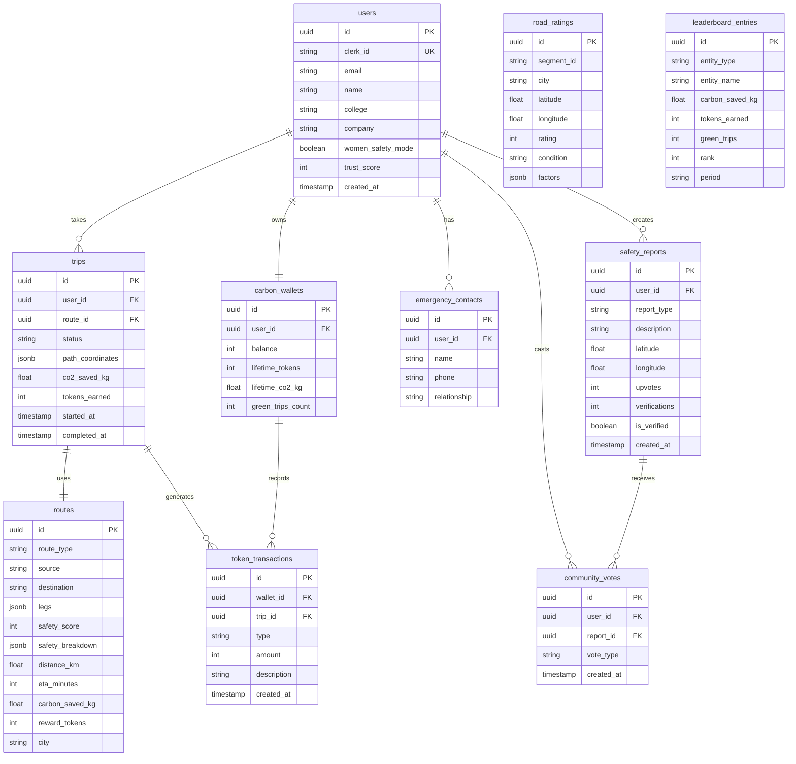

# SafarAI — Database Schema

## ER Diagram



## SQL Migration

See `database/migrations/001_initial_schema.sql`

## Indexes

```sql
CREATE INDEX idx_trips_user_status ON trips(user_id, status);
CREATE INDEX idx_safety_reports_geo ON safety_reports(latitude, longitude);
CREATE INDEX idx_safety_reports_type ON safety_reports(report_type);
CREATE INDEX idx_leaderboard_period ON leaderboard_entries(period, entity_type, rank);
CREATE INDEX idx_token_tx_wallet ON token_transactions(wallet_id, created_at DESC);
```

## Seed Data

See `database/seeds/hyderabad_seed.sql` and `backend/app/data/hyderabad/`
