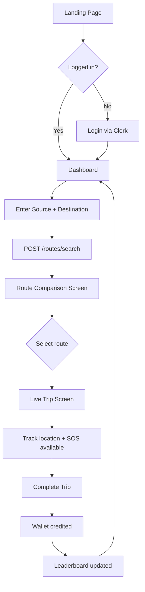
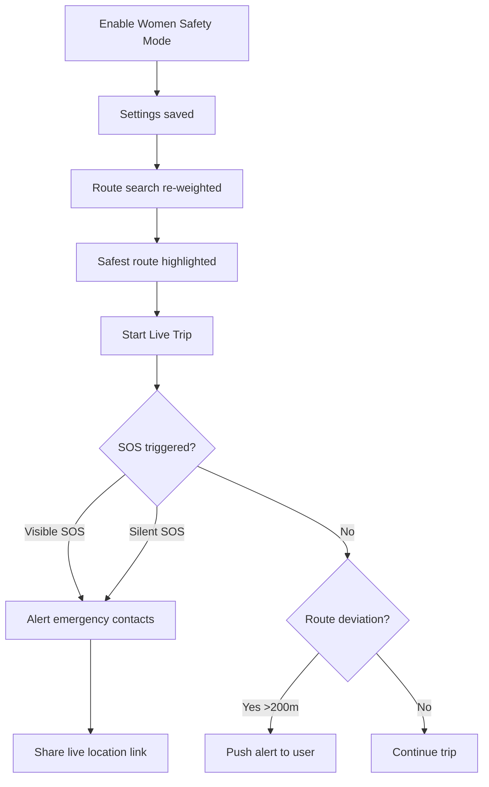
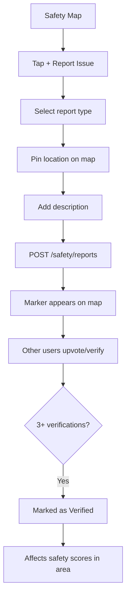
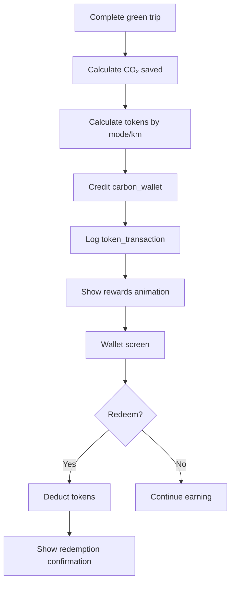
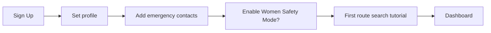

# SafarAI — User Flow Diagrams

## Primary Flow: Plan → Travel → Earn

```mermaid
flowchart TD
    A[Landing Page] --> B{Logged in?}
    B -->|No| C[Login via Clerk]
    B -->|Yes| D[Dashboard]
    C --> D
    D --> E[Enter Source + Destination]
    E --> F[POST /routes/search]
    F --> G[Route Comparison Screen]
    G --> H{Select route}
    H --> I[Live Trip Screen]
    I --> J[Track location + SOS available]
    J --> K[Complete Trip]
    K --> L[Wallet credited]
    L --> M[Leaderboard updated]
    M --> D
```

## Women Safety Mode Flow

```mermaid
flowchart TD
    A[Enable Women Safety Mode] --> B[Settings saved]
    B --> C[Route search re-weighted]
    C --> D[Safest route highlighted]
    D --> E[Start Live Trip]
    E --> F{SOS triggered?}
    F -->|Visible SOS| G[Alert emergency contacts]
    F -->|Silent SOS| G
    F -->|No| H{Route deviation?}
    H -->|Yes >200m| I[Push alert to user]
    H -->|No| J[Continue trip]
    G --> K[Share live location link]
```

## Community Report Flow

```mermaid
flowchart TD
    A[Safety Map] --> B[Tap + Report Issue]
    B --> C[Select report type]
    C --> D[Pin location on map]
    D --> E[Add description]
    E --> F[POST /safety/reports]
    F --> G[Marker appears on map]
    G --> H[Other users upvote/verify]
    H --> I{3+ verifications?}
    I -->|Yes| J[Marked as Verified]
    J --> K[Affects safety scores in area]
```

## Token Earn & Redeem Flow

```mermaid
flowchart TD
    A[Complete green trip] --> B[Calculate CO₂ saved]
    B --> C[Calculate tokens by mode/km]
    C --> D[Credit carbon_wallet]
    D --> E[Log token_transaction]
    E --> F[Show rewards animation]
    F --> G[Wallet screen]
    G --> H{Redeem?}
    H -->|Yes| I[Deduct tokens]
    I --> J[Show redemption confirmation]
    H -->|No| K[Continue earning]
```

## Onboarding Flow

```mermaid
flowchart LR
    A[Sign Up] --> B[Set profile]
    B --> C[Add emergency contacts]
    C --> D[Enable Women Safety Mode?]
    D --> E[First route search tutorial]
    E --> F[Dashboard]
```
